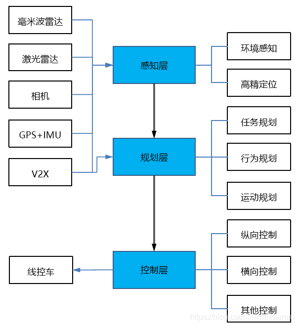

# SLAM以及路径规划部分

**河北科技大学机器人战队Actor&Thinker RM2023哨兵导航部分代码**

**本项目基于ros-noetic**

**学习时间很短加之本人水平有限，请各位大佬发现问题不吝赐教**

**有批评问题欢迎各位佬联系QQ：2782760102**

本文主要描述了本赛季六个来月学习的一些小理解，主要讲一些常用topic

首先学习哨兵底盘算法之前建议了解一下无人驾驶系统的架构

## 一、算法的架构组成



首先拿出无人驾驶系统架构

需要重点强调一下的就是规划层的任务规划和运动规划。其中任务规划属于是一个大范围低分辨率的路径规划，它能够规划从车体到goal-point的整体路径，他的主要作用是纵观全局的去做规划，当无人车走到死角的时候能够及时的重新规划一条路径，并将整体路径分成小部分距离无人车近的路径，发布话题给运动规划。运动规划属于是一个小范围高分辨率的路径规划，他的主要作用是小范围的导航，但是他包含了避障等功能

### 1.感知层

* 感知层使用的算法是fast-lio2

### 2.规划层

* 任务规划使用的算法是far_planner
* 行为规划和运动规划使用的算法是autonomous_exploration_development_environment
* 注意：行为规划和运动规划算法实车部署的时候，起作用的是里面的内置算法[ground_based_autonomy_basic](https://github.com/jizhang-cmu/ground_based_autonomy_basic)，autonomous_exploration_development_environment实际上是一个仿真平台。用起来更方便

### 3.控制层

* 发送x y yaw指令到单片机执行。

## 二、算法中的部分pkg的作用

### 感知层

感知层只用了fastlio，地图话题为`/cloud_registered`，里程计话题为`/Odometry`

### 规划层

#### 任务规划

任务规划为far_planner，只部署的话，far_planner.cpp中有一个话题`/goal_point`为目标点，拥有目标点之后，他会计算整体路径并且拆分整体路径发送航路点到行为规划。

如果行为规划和运动规划所运用的都是cmu官方的开源代码，则不需要修改话题。否则需要修改far_planner.launch中的话题

#### 行为规划

行为规划一般是自己写的决策

#### 运动规划

local_planner
pathFollower

#### 运动规划放在一起说

在开源代码autonomous_exploration_development_environment中，有以下pkg

1. joystick_drivers

2. loam_interface
3. local_planner
4. sensor_scan_generation
5. terrain_analysis
6. terrain_analysis_ext
7. vehicle_simulator
8. velodyne_simulator
9. visualization_tools
10. waypoint_example
11. waypoint_rviz_plugin

其中，

​	**1为ros的手柄pkg**，用于订阅手柄的消息，手柄可控制小车移动，用作调试用。比如1. 避障效果：前方有障碍物的时候，及时手柄操控一直向前，也是可以自动避障的。2. 底层嵌入式的坐标系方向与ros坐标系方向是否一致：检查运动方向是否一致，往左推向右走就是有问题。3. 底层嵌入式相对于pc的反应速度：反应速度太慢会导致使用时车身抖动。

****

​	**2为slam接口pkg**直接修改loam_interface的launch文件，可以修改点云图和里程计的话题以及是否需要坐标变换，并且cmu官方给出了部分常用slam开源代码与规划层代码对接的[实例](https://drive.google.com/file/d/1jW1jFDvRsUWcfivC6WWcHHdX-JDSzPGo/view)

****

​	**3.为运动规划的主要代码**，其中，local_planner作为局部路径规划器，通过MATLAB生成了小车的所有可行驶路径：在rviz中可视为车身（雷达）坐标系周围的一圈或者一部分圆弧的黄色路径，路径和matlab源码存储在该pkg下的paths目录中，可通过更改变量`scale`来改变实际车体的半径（不是很确定）。local_planner中订阅了一个名为`/way_point`的话题，此话题为航路点，也就是小车局部规划的目标点。他的来源为上层规划算法far_planner发送，自己发送，或者使用rviz+官方的way_point插件，它适用于短距离的避障等行为，far_planner的goal_point更适用于远距离的整体规划。然后通过航路点，地形分析等各种条件local会计算出最优路径通过发布话题`/path`的行为将最优路径发送到path_follower上，path_follower会使用类似pid控制算法的形式计算出跟随该路径需要的x y yaw的速度，并且通过话题`/cmd_vel`发布，想要根据雷达，路径规划控制小车移动，可以订阅该消息。

****

​	**4为传感器等消息的坐标变换**

****

​	**5为地面可通过点云分析**，该开源算法，适用于地面四轮机器人，所以在雷达点云中，会有一部分点云是地面，有一部分是障碍物，并且一般情况下地面和障碍物还是相接的，该pkg可以通过几何方式去分析点云是地面还是障碍物还是坡，用于上层规划器（far_planner）和行为规划和运动规划的计算。

****

​	**6为拓展地面可通过点云分析**，和5效果一样，但是6属于是大范围低分辨率，5属于小范围高分辨率，6更多的用于上层规划器的全局的规划，似乎行为规划和运动规划并没有用上。该开源代码就是让大范围低分辨率和小范围高分辨率结合，提高了任务规划的效率，加强了行为规划的稳定性

****

​	**7为该开源算法的仿真平台的仿真相关的东西**，他包含了仿真所需的机器人模型，地图的.ply，地图的.world，在mesh目录下运行download_environment.sh以下载仿真所需环境。他提供了代码去实时的更新gazebo中的模型位置，通过仿真获取雷达点云图，计算里程计等。另外部署真实机器人时，也需要用到该pkg下的launch启动文件system_real_robot.launch

****

​	**8，9，10，11等均为仿真所用的pkg**，能用就行

## 三、关于调参

### 感知层

如果是室内使用fast_lio，可以参考一下https://github.com/hku-mars/FAST_LIO/issues/169

### 规划层

规划层调参时主要集中在local_planner的launch文件和terrain_analysis的launch文件中

在**local_planner.launch**中（不一定对）

* sensorOffsetX、sensorOffsetY：为传感器在X、Y轴上相对于车体中心点的偏移
* twoWayDrive：双向驱动：就是车体能不能反向走（倒车）
* maxSpeed：X、Y轴的最大速度
* autonomyMode：自主模式：跟手柄有关
* vehicleLength：车长
* vehicleWidth：车宽
* obstacleHeightThre：障碍物阈值，高于这个值就会被认定成障碍物，否则坡度合适的情况下会认定为斜坡
* groundHeightThre：地面高度阈值，设置太小会导致原地旋转
* minRelZ、maxRelZ：需要调参，但是并不是很清楚具体意义，应该是点云处理的范围
* maxYawRate：最大角速度（单位：°）

在**terrain_analysis.launch**中

* vehicleHeight：雷达安装高度

## 四、关于一些话题

* /stop：在pathFollower.cpp中有以下源码

```c++
void stopHandler(const std_msgs::Int8::ConstPtr& stop)
{
  safetyStop = stop->data;
}

ros::Subscriber subStop = nh.subscribe<std_msgs::Int8> ("/stop", 5, stopHandler);

if (safetyStop >= 1) vehicleSpeed = 0;
if (safetyStop >= 2) vehicleYawRate = 0;
```

由此可知，当设置stop >= 2时，就可以让车停止(X Y Yaw期望速度都为0)


* /speed：在pathFollower.cpp中有以下源码

```c++
void speedHandler(const std_msgs::Float32::ConstPtr& speed)
{
  double speedTime = ros::Time::now().toSec();

  if (autonomyMode && speedTime - joyTime > joyToSpeedDelay && joySpeedRaw == 0) {
    joySpeed = speed->data / maxSpeed;

    if (joySpeed < 0) joySpeed = 0;
    else if (joySpeed > 1.0) joySpeed = 1.0;
  }
}

ros::Subscriber subSpeed = nh.subscribe<std_msgs::Float32> ("/speed", 5, speedHandler);
```

此话题用于设置移动速度，但是不会超过在launch文件中的maxspeed，超过则等于maxspeed，可以用于某些情况下加速行驶。


* /cmd_vel：控制话题，包含了X Y Yaw三轴期望速度，订阅后直接做用于底盘期望速度
* /way_point & /goal_point：/way_point用于local_planner的航路点（目标点），localplanner中的目标点其实还有方向，所以不是很建议用这个目标点，应该用/goal_point，但是有一点可圈可点的是：/way_point航路点寻迹的时候如果路径被阻塞，不会全局改变路径。这个可以简单利用一下

## 五、整体运行流程

首先使用pkg `livox_ros_driver2`驱动MID360发布点云数据（"/livox/lidar"）和imu数据（"/livox/imu"），这些数据由感知层（fast_lio）订阅并处理。

然后经过fast_lio处理后，fast_lio会发布两个话题，分别是环境感知（点云地图"/cloud_registered"）和高精定位（里程计"/Odometry"），这两个话题会被loam_interface订阅并进行旋转变换(也可能不变，看具体用哪个算法)和话题名称，坐标系名称变换，用于整个规划层。

然后terrain_analysis 和 terrain_analysis_ext进行地面点云分析，分析出来可通行的路面，分别作用于后续的上层规划和下层规划。上层规划far_planner利用他们和goal_point计算出整体路径中的分开的航路点作用于local_planner。下层规划利用他和way_point以及已经生成好的路径计算出可行驶路径中最优的一条，发布话题。由pathfollower订阅，进行路径循迹
